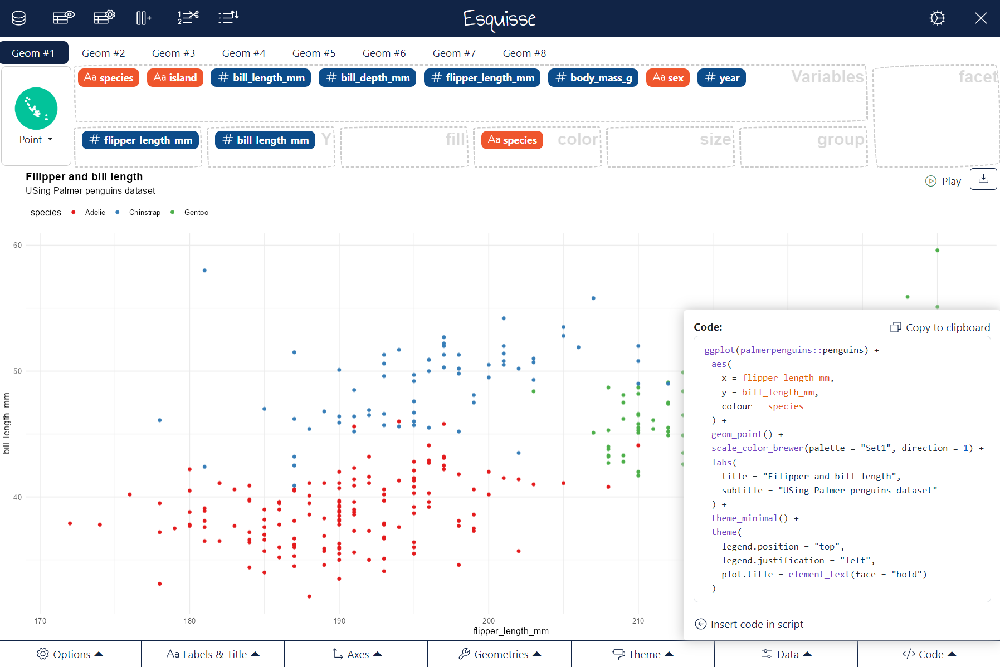

# esquisse 

> The purpose of this add-in is to let you explore your data quickly to extract the information they hold. You can create visualization with [{ggplot2}](https://ggplot2.tidyverse.org/), filter data with [{dplyr}](https://dplyr.tidyverse.org/) and retrieve generated code.

<!-- badges: start -->
[](https://CRAN.R-project.org/package=esquisse)
[](https://CRAN.R-project.org/package=esquisse)
[](https://lifecycle.r-lib.org/articles/stages.html)
[](https://github.com/dreamRs/esquisse/actions)
<!-- badges: end -->

This addin allows you to interactively explore your data by visualizing it with the [ggplot2](https://github.com/tidyverse/ggplot2) package. It allows you to draw bar plots, curves, scatter plots, histograms, boxplot and [sf](https://github.com/r-spatial/sf) objects, then export the graph or retrieve the code to reproduce the graph.

See online documentation : https://dreamrs.github.io/esquisse/index.html

If you find bugs, please open an [issue](https://github.com/dreamRs/esquisse/issues)


## Installation

Install from CRAN with :

```r
install.packages("esquisse")
```

Or install development version from GitHub :

```r
remotes::install_github("dreamRs/esquisse")
```

Then launch the addin via the RStudio menu or with `esquisse::esquisser()`.


## esquisse addin

```r
esquisse::esquisser()
# or with your data:
esquisse::esquisser(palmerpenguins::penguins)
```


Above gif was made with :heart: by [@mfanny](https://github.com/mfanny) and cannot be removed, but in the meantime {esquisse} has evolved, the latest version now looks like:




