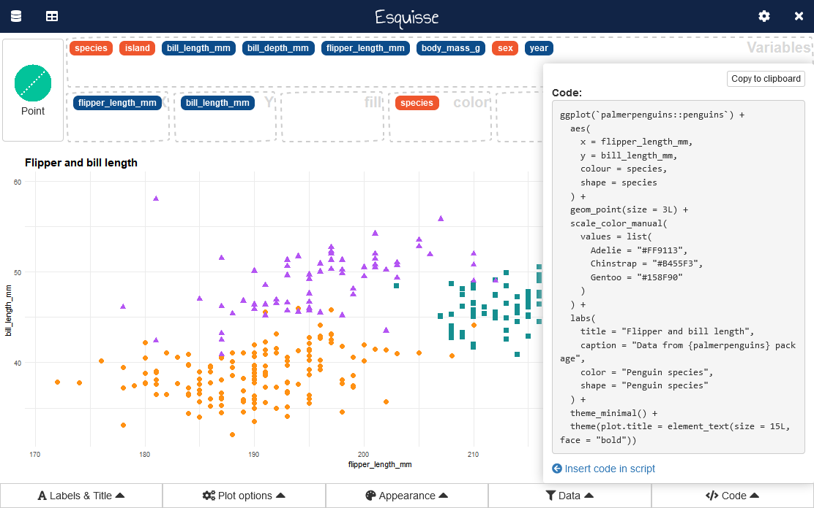

<!-- README.md is generated from README.Rmd. Please edit that file -->

# esquisse 

> The purpose of this add-in is to let you explore your data quickly to
> extract the information they hold. You can create visualization with
> [{ggplot2}](https://ggplot2.tidyverse.org/), filter data with
> [{dplyr}](https://dplyr.tidyverse.org/) and retrieve generated code.

<!-- badges: start -->

[](https://CRAN.R-project.org/package=esquisse)
[](https://CRAN.R-project.org/package=esquisse)
[](https://lifecycle.r-lib.org/articles/stages.html)
[](https://github.com/dreamRs/esquisse/actions)
<!-- badges: end -->

This addin allows you to interactively explore your data by visualizing
it with the [ggplot2](https://github.com/tidyverse/ggplot2) package. It
allows you to draw bar plots, curves, scatter plots, histograms, boxplot
and [sf](https://github.com/r-spatial/sf) objects, then export the graph
or retrieve the code to reproduce the graph.

See online documentation :
<https://dreamrs.github.io/esquisse/index.html>

If you find bugs, please open an
[issue](https://github.com/dreamRs/esquisse/issues)

## Installation

Install from [CRAN](https://CRAN.R-project.org/package=esquisse) with :

``` r
install.packages("esquisse")
```

Or install development version from
[GitHub](https://github.com/dreamRs/esquisse) :

``` r
remotes::install_github("dreamRs/esquisse")
```

Then launch the addin via the RStudio menu or with
`esquisse::esquisser()`.

## esquisse addin

``` r
esquisse::esquisser()
# or with your data:
esquisse::esquisser(palmerpenguins::penguins)
```


Above gif was made with :heart: by [@mfanny](https://github.com/mfanny)
and cannot be removed, but in the meantime {esquisse} has evolved, the
latest version now looks like:


### Internationalization

Currently you can use {datamods} in the following language:

english (default),

french,

macedonian,

brazilian portuguese,

albanian,

chinese,

spanish,

turkish,

korean,

polish,

japanese.

``` r
library(esquisse)
set_i18n("fr")
esquisser()
```

If you want another language to be supported, you can submit a Pull
Request to add a CSV file like the one used for french (file is located
in `inst/i18n` folder in the package, you can see it [here on
GitHub](https://github.com/dreamRs/esquisse/blob/master/inst/i18n/fr.csv)).

See [{datamods}
vignette](https://dreamrs.github.io/datamods/articles/i18n.html) for
more on this topic.
