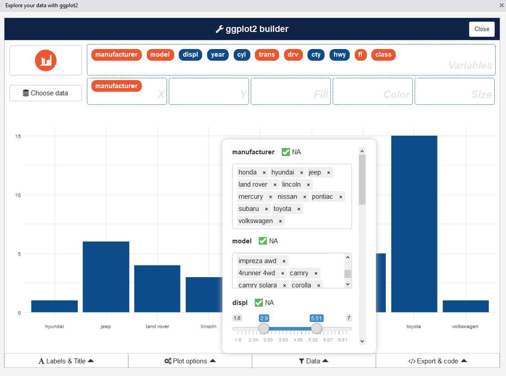
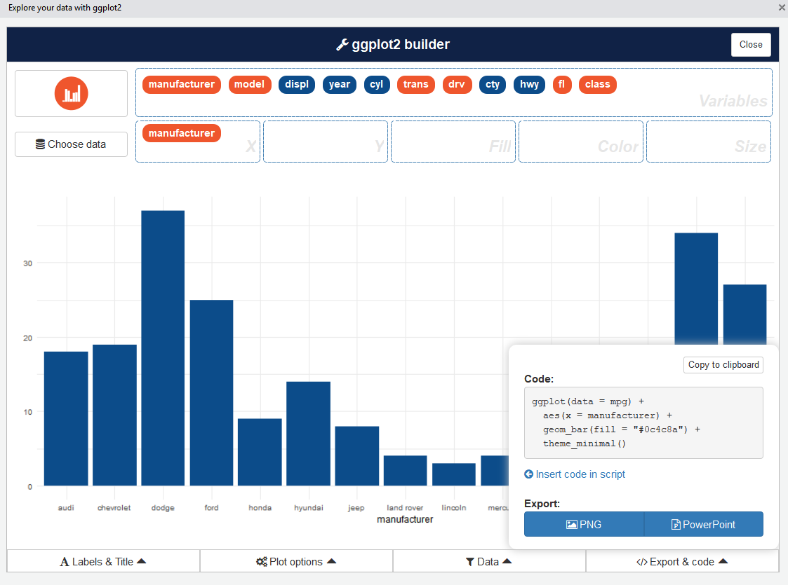

# esquisse 

> The purpose of this add-in is to let you explore your data quickly to extract the information they hold. You can only create simple plots, you won't be able to use custom scales and all the power of ggplot2. This is just the start!

[](https://www.repostatus.org/#active)
[](https://CRAN.R-project.org/package=esquisse)
[](https://travis-ci.org/dreamRs/esquisse)


This addin allows you to interactively explore your data by visualizing it with the ggplot2 package. It allows you to draw bar graphs, curves, scatter plots, histograms, then export the graph or retrieve the code generating the graph.


If you find bugs, please open an [issue](https://github.com/dreamRs/esquisse/issues)


## Installation

Install from CRAN with :

```r
# From CRAN
install.packages("esquisse")
```

Or install dev version from GitHub :

```r
# with remotes
remotes::install_github("dreamRs/esquisse")

# or with install-github.me service (based on remotes)
source("https://install-github.me/dreamRs/esquisse")

# or with devtools:
devtools::install_github("dreamRs/esquisse")
```

Then launch the addin via the RStudio menu, if you don't have `data.frame` in your environment, datasets in `ggplot2` are used.


## `ggplot2` builder addin


Launch addin via RStudio menu or with:

```r
esquisse::esquisser()
```

First step is to choose a `data.frame`:


Or you can use a dataset directly with:

```r
esquisse::esquisser(data = iris)
```


After that, you can drag and drop variables to create a plot:


Four sub-menus are available under the chart to modify some parameters:

### Labels

Set chart's labs with this menu:


### Plot options

Choose color, geom parameters and theme:


### Filter data

:warning: Experimental !

Filter your data:




### Code & export

Export your plot and retrieve the code to reproduce it:




### Display mode

You can change where addin is displayed by setting option `esquisse.display.mode`, possibilities are :

* `dialog` (default) : use RStudio dialog window
* `pane` : RStudio's Viewer
* `browser` : default browser

For example, launch in browser :

```r
options("esquisse.display.mode" = "browser")
esquisser()
```


