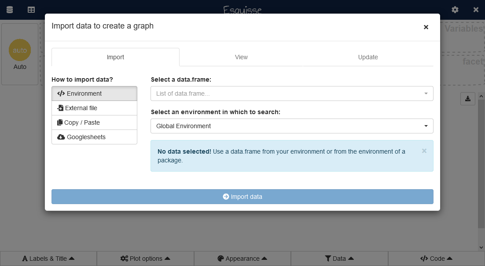
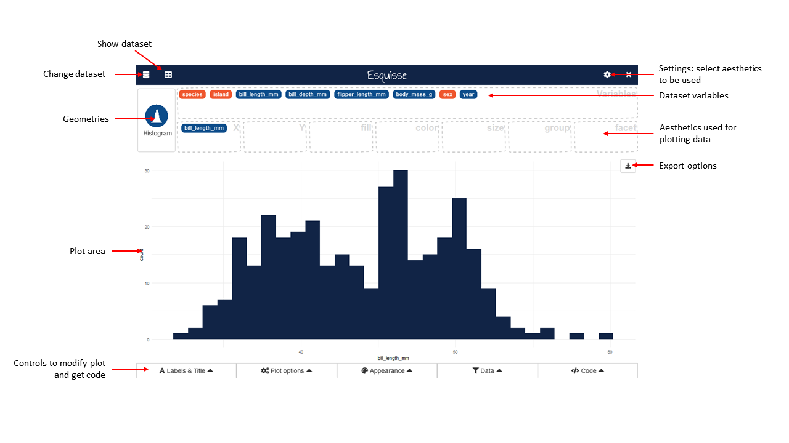
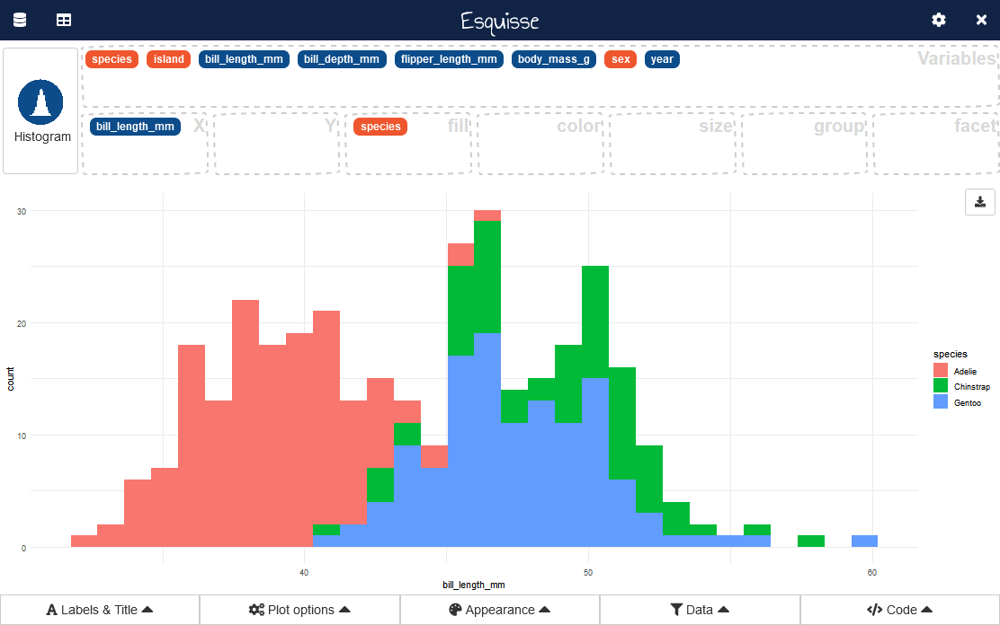
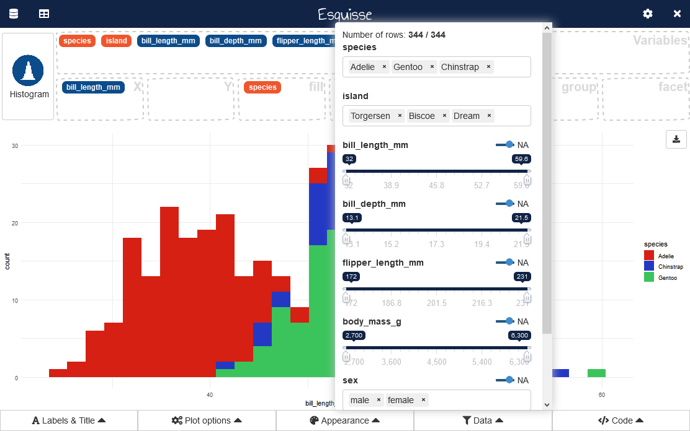
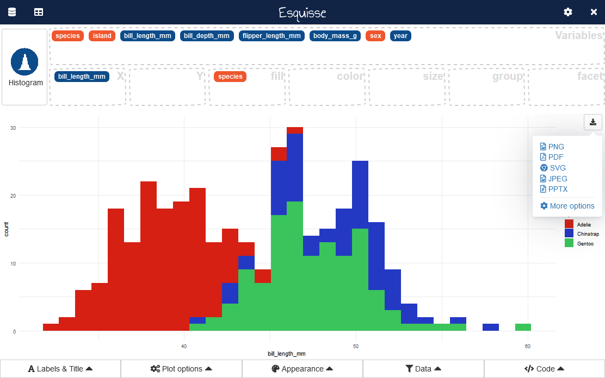

```{r, include = FALSE}
knitr::opts_chunk$set(
  collapse = TRUE,
  comment = "#>",
  eval = FALSE
)
```

```{r setup}
library(esquisse)
```


<style>
img {
  max-width: 700px;
}
</style>


## Launch the addin

In RStudio, you can use the *Addins* menu : 


Or in the R console :

```{r}
esquisser()
```


To use a `data.frame` by default, if using the *Addins* menu highlight with the cursor a `data.frame` in source editor before launching addin.
Otherwise, pass the `data.frame` as first argument to the function :

```{r}
esquisser(mtcars)
```


## Import data into {esquisse}

If you don't have used a `data.frame` when launching the addin, a window to import data will appear.

This feature comes from package [{datamods}](https://github.com/dreamRs/datamods), you can find more documentation about it [here](https://dreamrs.github.io/datamods/articles/datamods.html).




## Create a plot

This is the main interface and the most interesting part of the addin (in example below, we use `penguins` dataset from [{palmerpenguins}](https://github.com/allisonhorst/palmerpenguins)) :



You can select aesthetics to used by clicking the gear icon in top right corner, then drag-and-drop into aesthetics boxes to create a plot: 




A `geometry` is automatically picked to represent the data, according to data type. You can select an other `geom` with button in top right corner : 


## Controls

Five menus under plot area are available to set plot parameters, filter data and retrieve code to generate the plot.


### Labels & titles

This menu allow to set plot's title, subtitle, caption, axis and aesthetics labels :


### Plot options

Here you can modify plot parameters, options available in the menu depends on type of plot :


### Appearance

Here you can modify colors used and global theme :


### Filter

Widgets to interactively filter data used in plot : 



The filter module is available in package [{datamods}](https://dreamrs.github.io/datamods/articles/datamods.html#filter).

The code used to filter the data will be available in the following menu.


### Code

In this menu, you can retrieve the code used to produce the plot, as well as the code used to filter the data.


You can copy code to clipboard, or insert it in your current script.


## Export

You can save the plot created in various format by clicking the button in plot area's top-right corner:



With "More options", you can access a new window with more parameters to export the plot:


## Addin options

By default, esquisse is launched into a dialog window (if in RStudio), you can choose to use your browser if you prefer, or the Viewer pane.

```{r}
esquisser(viewer = "browser")
esquisser(viewer = "pane")
```


You can set display mode with an option (in .Rprofile for example) :

```{r}
options("esquisse.viewer" = "browser")
```

