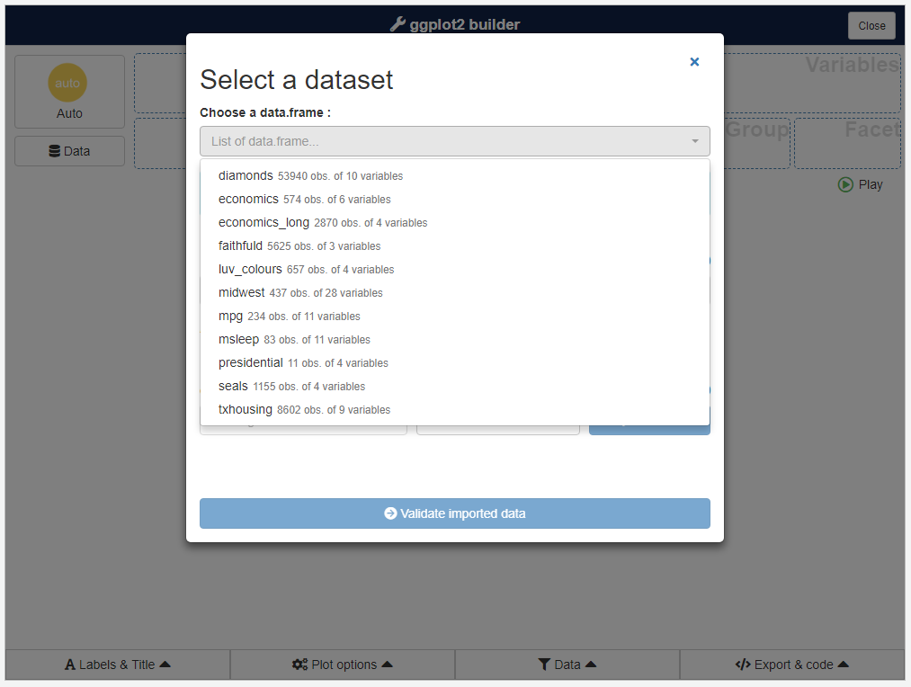
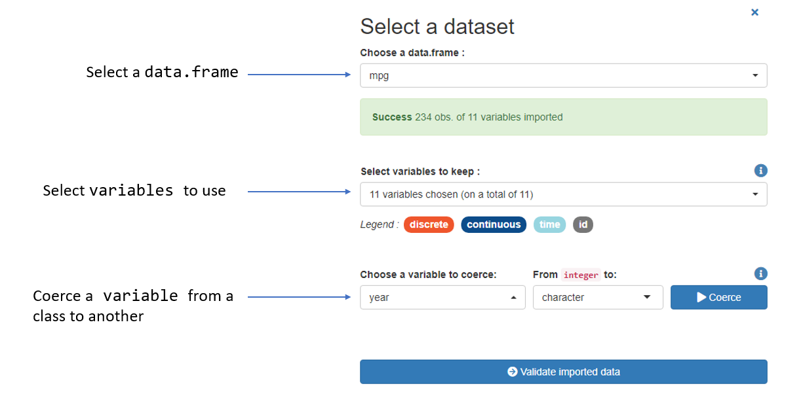
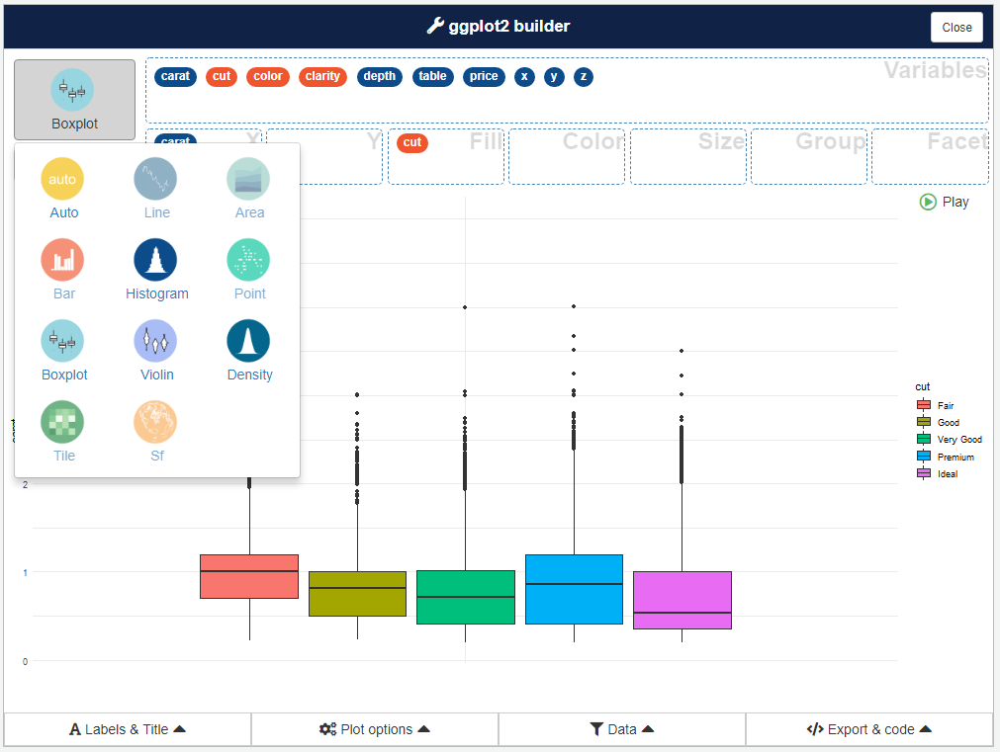
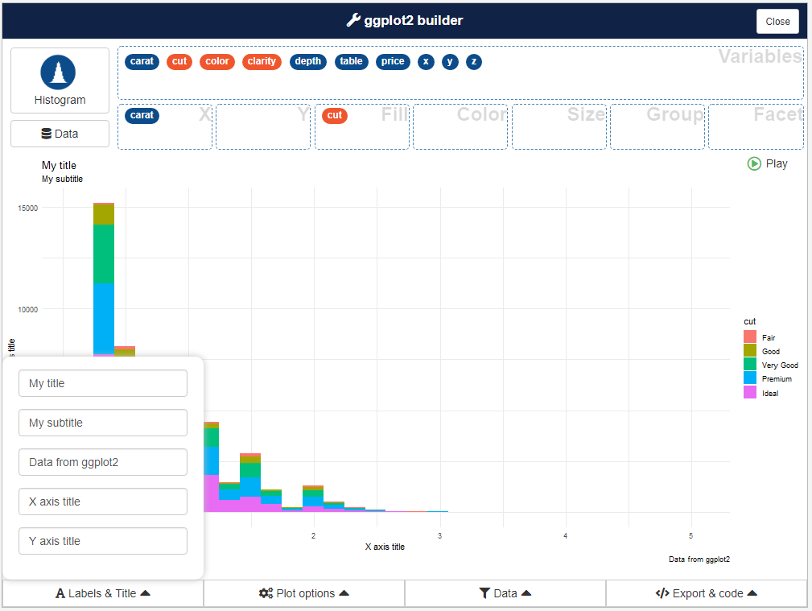
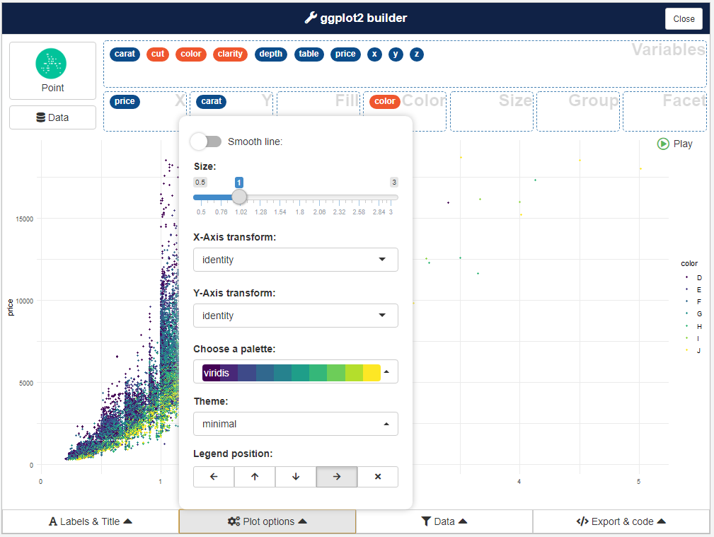

```{r, include = FALSE}
knitr::opts_chunk$set(
  collapse = TRUE,
  comment = "#>",
  eval = FALSE
)
```

```{r setup}
library(esquisse)
```


<style>
img {
  max-width: 700px;
}
</style>


## Launch the addin

In RStudio, you can use the *Addins* menu : 


Or in the R console :

```{r}
esquisser()
```


To use a `data.frame` by default, if using the *Addins* menu highlight with the cursor a `data.frame` in source editor before launching addin.
Otherwise, pass the `data.frame` as first argument to the function :

```{r}
esquisser(iris)
```


## Select data

If addin is launched without default data, a window will appear to select a `data.frame` from Global environment (if no `data.frame` are present, datasets from {ggplot2} will be used) :





Once you have selected a `data.frame`, click on the bottom button to start the plotting part.

You can change data selected after that step by clicking *Data* button.


## Create a plot

This is the main interface and the most interesting part of the addin (in example below, we use `diamonds` dataset from {ggplot2}) :


To create a chart, drag and drop variables into aesthetics boxes :


A **geom** is automatically picked to represent the data, according to data type you can select an other geom with button in top right corner : 




## Controls

Four menu under plot area are available to set plot parameters, filter data and retrieve code to generate the plot.

### Labels & titles

This menu allow to set plot's title, subtitle, caption and axis labels :




### Plot options

Here you can modify plot appearance and parameters, options available in the menu depends on type of plot :





### Filter

Widgets to interactively filter data used in plot : 


The code used to filter the data will be available in the following menu.


### Export & Code

In this menu, you can retrieve the code used to produce the plot, as well as the code used to filter the data, and export the plot to PNG or PowerPoint.


You can copy code to clipboard, or insert it in your current script.


## Addin options

By default, esquisse is launched into a dialog window (if in RStudio), you can choose to use your browser if you prefer, or the Viewer pane.

```{r}
esquisser(viewer = "browser")
esquisser(viewer = "pane")
```


You can set display mode with an option (in .Rprofile for example) :

```{r}
options("esquisse.viewer" = "browser")
```

