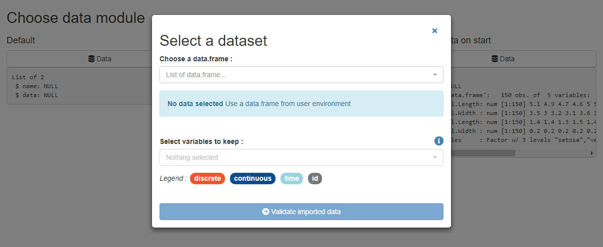
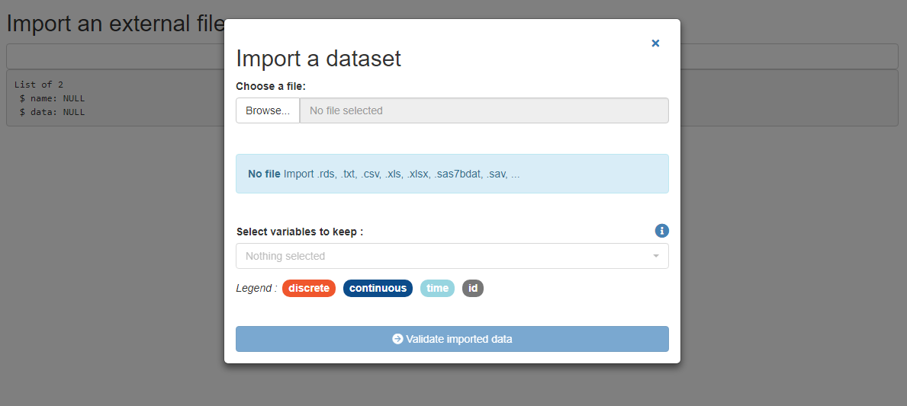
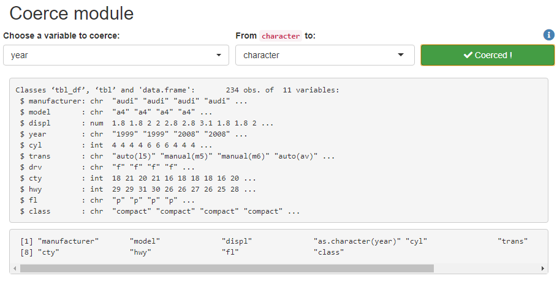

```{r, include = FALSE}
knitr::opts_chunk$set(
  collapse = TRUE,
  comment = "#>",
  eval = FALSE
)
```

```{r setup}
library(shiny)
library(esquisse)
```

<style>
img {
  max-width: 700px;
}
</style>


## Use esquisse as a Shiny module

{esquisse} is built with Shiny modules (see this [article](https://shiny.rstudio.com/articles/modules.html) for reference), so you can use {esquisse} directly into a Shiny application :

```{r}
ui <- fluidPage(
  
  titlePanel("Use esquisse as a Shiny module"),
  
  sidebarLayout(
    sidebarPanel(
      radioButtons(
        inputId = "data", 
        label = "Data to use:", 
        choices = c("iris", "mtcars"),
        inline = TRUE
      )
    ),
    mainPanel(
      tags$div(
        style = "height: 700px;", # needs to be in fixed height container
        esquisserUI(
          id = "esquisse", 
          header = FALSE, # dont display gadget title
          choose_data = FALSE # dont display button to change data
        )
      )
    )
  )
)

server <- function(input, output, session) {
  
  data_r <- reactiveValues(data = iris, name = "iris")
  
  observeEvent(input$data, {
    if (input$data == "iris") {
      data_r$data <- iris
      data_r$name <- "iris"
    } else {
      data_r$data <- mtcars
      data_r$name <- "mtcars"
    }
  })
  
  callModule(module = esquisserServer, id = "esquisse", data = data_r)
  
}

shinyApp(ui, server)
```

Result looks like : 


## Other exported modules

Some modules used in {esquisse} are exported, so you can use them in your Shiny applications.


### Filter data

Module to interactively filter a `data.frame` and retrieve the code :

```{r}
?`module-filterDF`

run_module("filterDF")
```


### Choose data

Module to interactively choose a `data.frame` in Global environment or to import an external file :

```{r}
?`module-chooseData`

run_module("chooseData")
```



With an external file, import will be performed by package [{rio}](https://github.com/leeper/rio) :

```{r}
run_module("chooseData2")
```





### Coerce variable

Coerce a variable from a class to another :

```{r}
?`module-coerce`

run_module("coerce")
```




## Input widgets

The drag-and-drop widget along with the button to select a geom are exported.

### dragulaInput

```{r}
ui <- fluidPage(
  tags$h2("Demo dragulaInput"),
  tags$br(),
  dragulaInput(
    inputId = "dad",
    sourceLabel = "Source",
    targetsLabels = c("Target 1", "Target 2"),
    choices = names(iris),
    width = "400px"
  ),
  verbatimTextOutput(outputId = "result")
)


server <- function(input, output, session) {
  
  output$result <- renderPrint(str(input$dad))

}

shinyApp(ui = ui, server = server)
```


### dropInput

```{r}
ui <- fluidPage(
    tags$h2("Drop Input"),
    dropInput(
      inputId = "mydrop",
      choicesNames = tagList(
        list(icon("home"), style = "width: 100px;"), 
        list(icon("flash"), style = "width: 100px;"),
        list(icon("cogs"), style = "width: 100px;"),
        list(icon("fire"), style = "width: 100px;"), 
        list(icon("users"), style = "width: 100px;"), 
        list(icon("info"), style = "width: 100px;")
      ), 
      choicesValues = c("home", "flash", "cogs",
                        "fire", "users", "info"),
      dropWidth = "220px"
    ),
    verbatimTextOutput(outputId = "res")
  )
  
  server <- function(input, output, session) {
    output$res <- renderPrint({
      input$mydrop
    })
  }
  
  shinyApp(ui, server)
```


