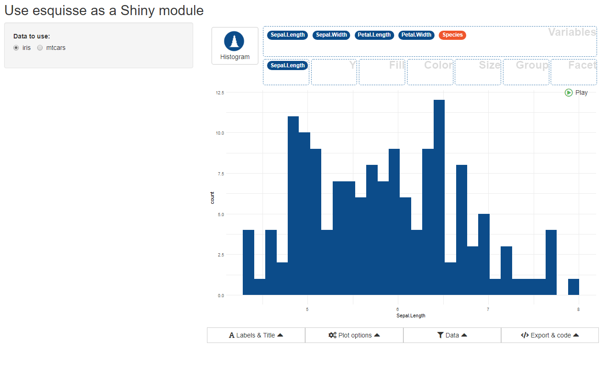
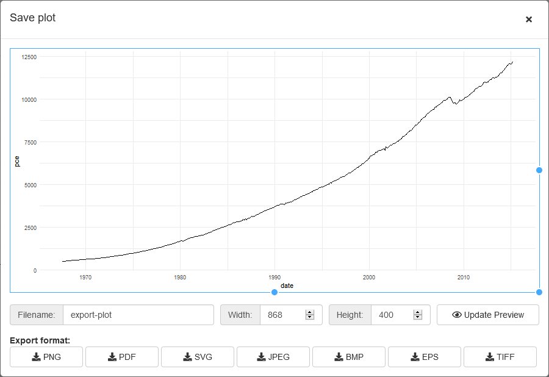
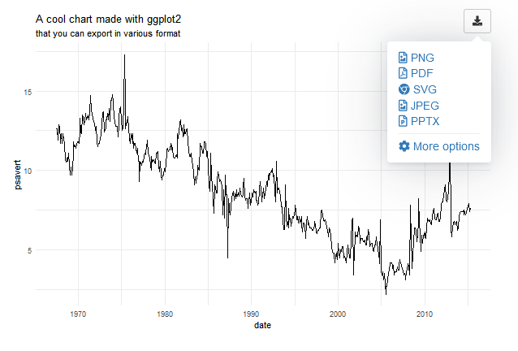
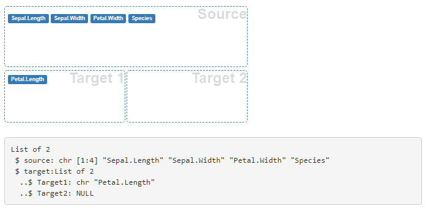
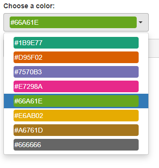
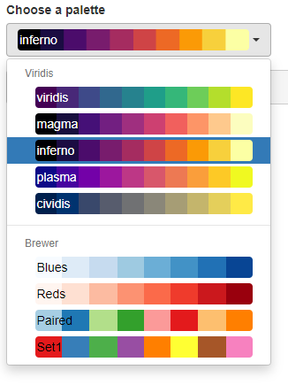

```{r, include = FALSE}
knitr::opts_chunk$set(
  collapse = TRUE,
  comment = "#>",
  eval = FALSE
)
```

```{r setup}
library(shiny)
library(esquisse)
```

<style>
img {
  max-width: 700px;
}
</style>


## Use esquisse as a Shiny module

{esquisse} is built with Shiny modules (see this [article](https://shiny.rstudio.com/articles/modules.html) for reference), so you can use {esquisse} directly into a Shiny application :

```{r esquisse-module}
library(esquisse)
library(shiny)
library(ggplot2)

ui <- fluidPage(
  
  titlePanel("Use esquisse as a Shiny module"),
  
  sidebarLayout(
    sidebarPanel(
      radioButtons(
        inputId = "data", 
        label = "Select data to use:", 
        choices = c("mpg", "diamonds", "economics")
      )
    ),
    mainPanel(
      tabsetPanel(
        tabPanel(
          title = "esquisse",
          esquisse_ui(
            id = "esquisse", 
            header = FALSE # dont display gadget title
          )
        ),
        tabPanel(
          title = "output",
          tags$b("Code:"),
          verbatimTextOutput("code"),
          tags$b("Filters:"),
          verbatimTextOutput("filters"),
          tags$b("Data:"),
          verbatimTextOutput("data")
        )
      )
    )
  )
)


server <- function(input, output, session) {
  
  data_r <- reactiveValues(data = iris, name = "iris")
  
  observe({
    data_r$data <- get(input$data)
    data_r$name <- input$data
  })
  
  results <- esquisse_server(
    id = "esquisse",
    data_rv = data_r
  )
  
  output$code <- renderPrint({
    results$code_plot
  })
  
  output$filters <- renderPrint({
    results$code_filters
  })
  
  output$data <- renderPrint({
    str(results$data)
  })
  
}

shinyApp(ui, server)
```

Result looks like : 




The output of the module is a `reactiveValues` with 3 slots : 

  * **code_plot** : code to generate plot.
  * **code_filters** : a list of length two with code to reproduce filters.
  * **data** : `data.frame` used in plot (with filters applied).


## Module for saving a ggplot object

This modulle allow to save a `ggplot` object in various format and to resize it before:



You can call the module from server to display it in a modal window (it's also possible to display it directly in your UI): 

```{r save-ggplot}
function(input, output, session) {
  
  observeEvent(input$save, { # actionButton to trigger modal
    save_ggplot_modal("ID", "Save plot") # launch modal
  })
  save_ggplot_server("ID", rv) # rv is a reactiValues with a slot 'plot'
  
}
```

See `?"save-ggplot-module"` for complete example.


## Module to render a plot and add export options

Add a menu to directly export plot, you can also launch module above for more controls (height, width, filename) by clicking "More options":



```{r render-ggplot}
library(shiny)
library(ggplot2)
library(esquisse)


ui <- fluidPage(
  tags$h2("ggplot output"),
  selectInput("var", "Variable:", names(economics)[-1]),
  ggplot_output("MYID", width = "600px")
)

server <- function(input, output, session) {
  
  render_ggplot("MYID", {
    ggplot(economics) + 
      geom_line(aes(date, !!sym(input$var))) + 
      theme_minimal() + 
      labs(
        title = "A cool chart made with ggplot2",
        subtitle = "that you can export in various format"
      )
  })
}

if (interactive())
  shinyApp(ui, server)
```


## Input widgets

The drag-and-drop widget along with the button to select a geom and the color/palette picker are exported:

### dragulaInput

```{r dragula-input}
ui <- fluidPage(
  tags$h2("Demo dragulaInput"),
  tags$br(),
  dragulaInput(
    inputId = "dad",
    sourceLabel = "Source",
    targetsLabels = c("Target 1", "Target 2"),
    choices = names(iris),
    width = "400px"
  ),
  verbatimTextOutput(outputId = "result")
)


server <- function(input, output, session) {
  
  output$result <- renderPrint(str(input$dad))

}

shinyApp(ui = ui, server = server)
```





### dropInput

The widget used to select a geom in `esquisser` addin. You can use images or icons for example:

```{r drop-input}
ui <- fluidPage(
  tags$h2("Drop Input"),
  dropInput(
    inputId = "mydrop",
    choicesNames = tagList(
      list(icon("home"), style = "width: 100px;"), 
      list(icon("flash"), style = "width: 100px;"),
      list(icon("cogs"), style = "width: 100px;"),
      list(icon("fire"), style = "width: 100px;"), 
      list(icon("users"), style = "width: 100px;"), 
      list(icon("info"), style = "width: 100px;")
    ), 
    choicesValues = c("home", "flash", "cogs",
                      "fire", "users", "info"),
    dropWidth = "220px"
  ),
  verbatimTextOutput(outputId = "res")
)

server <- function(input, output, session) {
  output$res <- renderPrint({
    input$mydrop
  })
}

shinyApp(ui, server)
```


### colorPicker

A select menu to choose one or several colors:

```{r color-picker}
ui <- fluidPage(
  tags$h2("Color Picker"),
  colorPicker(
    inputId = "col",
    label = "Choose a color:",
    choices = scales::brewer_pal(palette = "Dark2")(8),
    textColor = "white"
  ),
  verbatimTextOutput(outputId = "res")
)

server <- function(input, output, session) {
  output$res <- renderPrint({
    input$col
  })
}

shinyApp(ui, server)
```




### palettePicker

A select menu to choose a color palette:

```{r palette-picker}
library(scales)
ui <- fluidPage(
  tags$h2("Palette Picker"),
  palettePicker(
    inputId = "pal", 
    label = "Choose a palette", 
    choices = list(
      "Viridis" = list(
        "viridis" = viridis_pal(option = "viridis")(10),
        "magma" = viridis_pal(option = "magma")(10),
        "inferno" = viridis_pal(option = "inferno")(10),
        "plasma" = viridis_pal(option = "plasma")(10),
        "cividis" = viridis_pal(option = "cividis")(10)
      ),
      "Brewer" = list(
        "Blues" = brewer_pal(palette = "Blues")(8),
        "Reds" = brewer_pal(palette = "Reds")(8),
        "Paired" = brewer_pal(palette = "Paired")(8),
        "Set1" = brewer_pal(palette = "Set1")(8)
      )
    ), 
    textColor = c(
      rep("white", 5), rep("black", 4) 
    )
  ),
  verbatimTextOutput(outputId = "res")
)

server <- function(input, output, session) {
  output$res <- renderPrint({
    input$pal
  })
}

shinyApp(ui, server)
```



